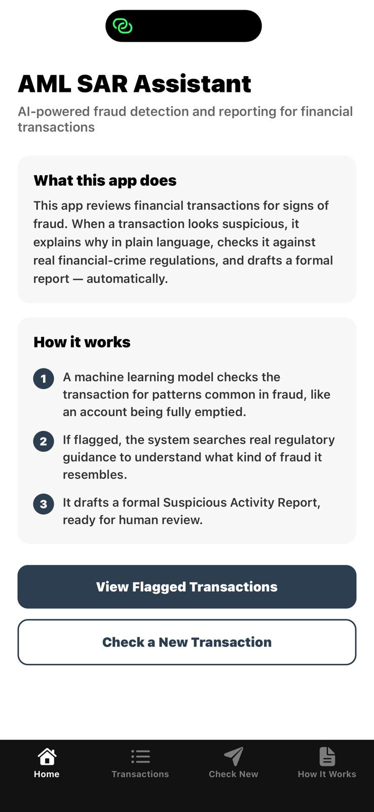
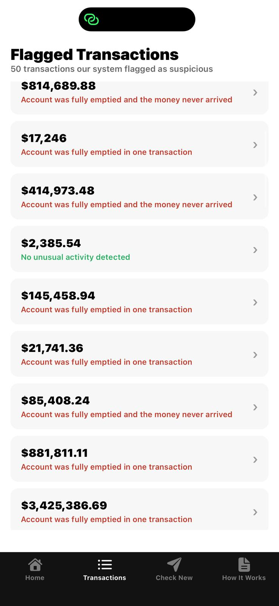
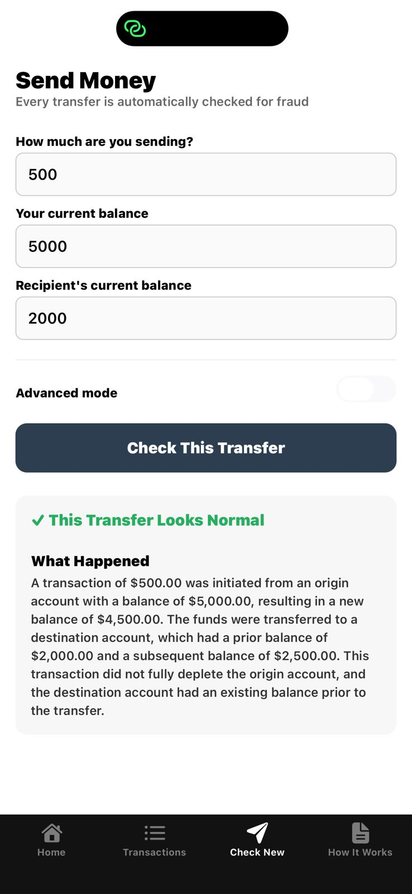
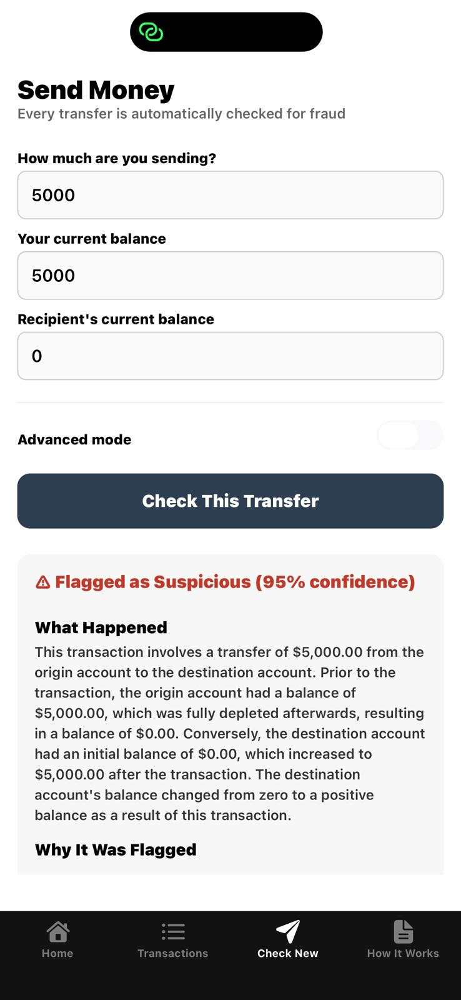
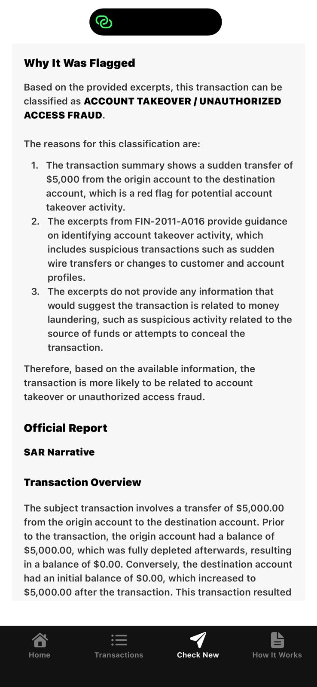
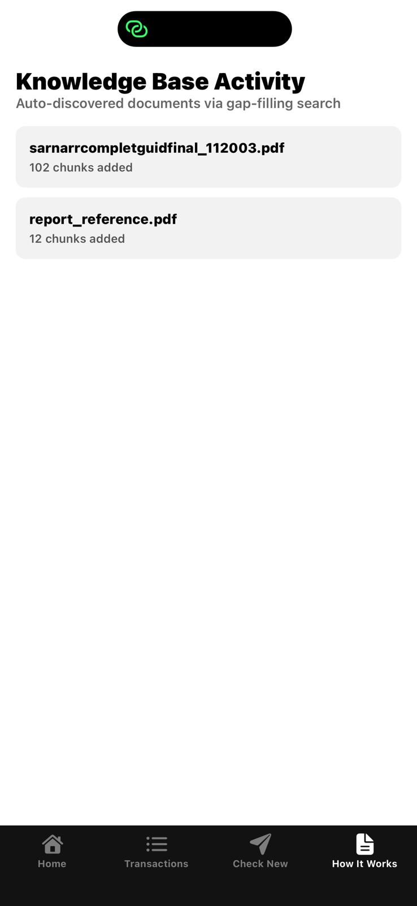

# AML SAR Assistant - Mobile App

A React Native (Expo) mobile app that puts a live, working AI fraud-detection pipeline in your hand. Enter a transaction and watch a trained ML model, a RAG-grounded knowledge base, and an LLM generate a full Suspicious Activity Report (SAR) end to end, in real time.

This is the mobile frontend for the [AML SAR Assistant](https://github.com/MHaris2002/aml-sar-assistant) project. The backend (FastAPI, detection model, RAG pipeline, LLM orchestration) lives in that repo; this app is the client.

## What it does

The app has four tabs:

**Home** - Explains what the app does and how the pipeline works, in plain language.

**Transactions** - Lists transactions the system has reviewed, each showing a plain-English reason (e.g. "Account was fully emptied and the money never arrived") rather than raw model output. Tap any transaction for the full breakdown: balances before/after, the AI's reasoning, and the drafted report.

**Check New** - The centerpiece. A simple "Send Money" form (amount, your balance, recipient's balance) that feels like an actual bank transfer no ledger jargon required. Behind the scenes it calls the backend's `/analyze` endpoint, which runs the full pipeline live:
1. Feature engineering (balance-mismatch detection)
2. Fraud prediction (trained Random Forest model)
3. RAG retrieval (grounded in real FinCEN/FATF regulatory documents)
4. LLM reasoning classifies the transaction as Money Laundering Typology or Account Takeover / Unauthorized Access Fraud
5. Auto-drafts a structured SAR narrative

An **Advanced mode** toggle reveals the raw before/after balance fields directly, for constructing exact test scenarios.

**How It Works** - Shows which documents the system has automatically discovered and ingested via its gap-filling search layer (a background process that searches trusted regulatory domains — FinCEN, FATF, OCC, Federal Reserve — when the RAG system's confidence is weak, and ingests better source material automatically).

## Screenshots

| Home | Transactions |
|---|---|
|  |  |

| Normal Transfer | Flagged Transfer |
|---|---|
|  |  |

| Full SAR Report | Knowledge Base |
|---|---|
|  |  |

## Tested scenarios

| Scenario | Amount | Result |
|---|---|---|
| Normal transfer, balances intact | $500 | ✅ Looks Normal |
| Large but proportionate transfer | $50,000 | ✅ Looks Normal |
| Full account drain to new recipient | $5,000 | ⚠️ Flagged — Account Takeover (95% confidence) |

## Tech stack

- **React Native** via **Expo** (SDK 54, using Expo Router for file-based navigation)
- **TypeScript**
- **react-native-markdown-display** for rendering the AI-generated reports cleanly
- Connects to a **FastAPI** backend over REST

## Why SDK 54

This project intentionally pins Expo SDK 54 rather than the latest release. At time of writing, Expo Go 56.0.1 has a [known bug](https://github.com/expo/expo/issues/46846) that rejects all SDK 56 projects SDK 54 is Expo's own recommended version "for learning with Expo Go" and avoids this issue entirely.

## Running locally

**Prerequisites:** Node.js, the [Expo Go](https://expo.dev/go) app on your phone, and the [backend](https://github.com/MHaris2002/aml-sar-assistant) running.

```bash
npm install
npx expo start
```

Scan the QR code with Expo Go (Android) or the Camera app (iOS). Your phone and laptop must be on the same network.

**Important:** the backend must be started with `--host 0.0.0.0` so it's reachable from your phone, not just `localhost`:
```bash
uvicorn backend.main:app --reload --host 0.0.0.0
```

Update the `API_BASE` constant at the top of each screen file (`app/(tabs)/dashboard.tsx`, `submit.tsx`, `knowledge.tsx`, `app/transaction-detail.tsx`) to match your machine's local network IP (find it via `ipconfig` on Windows or `ifconfig`/`ip addr` on Mac/Linux) — `127.0.0.1` will not work from a physical phone, since that address refers to the phone itself.

## App structure

```
app/
├── (tabs)/
│   ├── index.tsx        # Home screen
│   ├── dashboard.tsx     # Transaction list
│   ├── submit.tsx        # Check New Transaction
│   ├── knowledge.tsx     # How It Works (gap-filling log)
│   └── _layout.tsx       # Tab navigation config
└── transaction-detail.tsx  # Full detail view for a single transaction
```

## Known limitations

- IP address is currently hardcoded rather than configurable in-app — fine for local demo/development, would need an environment config or discovery mechanism for real deployment
- No authentication — this is a demo/portfolio project, not a production system handling real financial data
- Styling is fixed to light theme regardless of system dark/light mode setting, by design, to keep scope focused on functionality

## Related

- [Backend repo (aml-sar-assistant)](https://github.com/MHaris2002/aml-sar-assistant) — data pipeline, model training, RAG knowledge base, LLM orchestration, and Power BI dashboard
